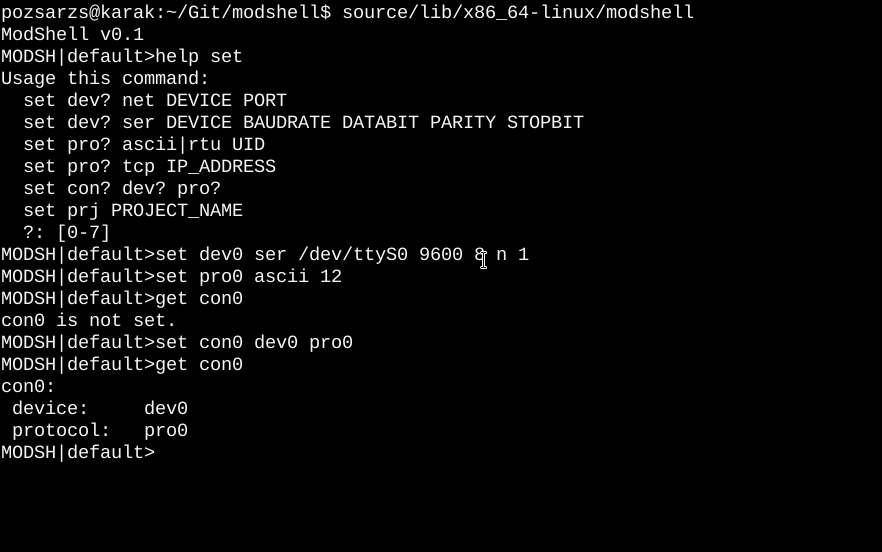
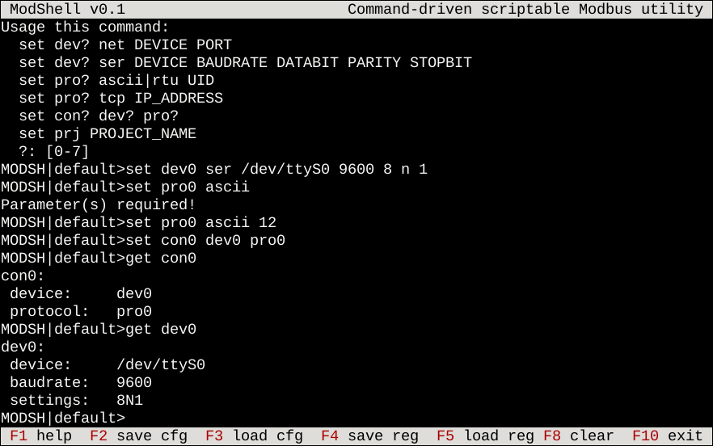
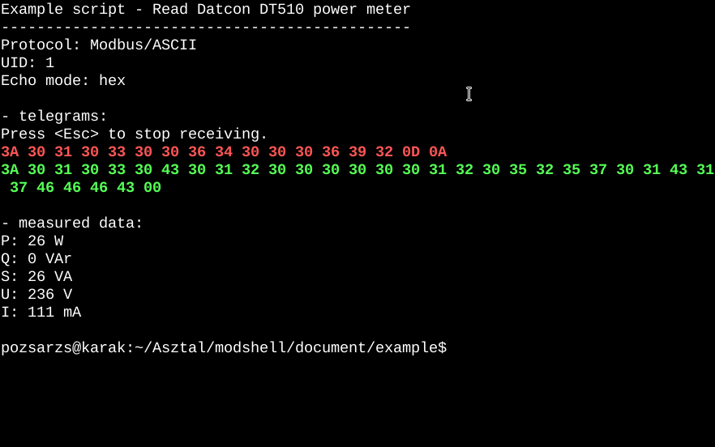
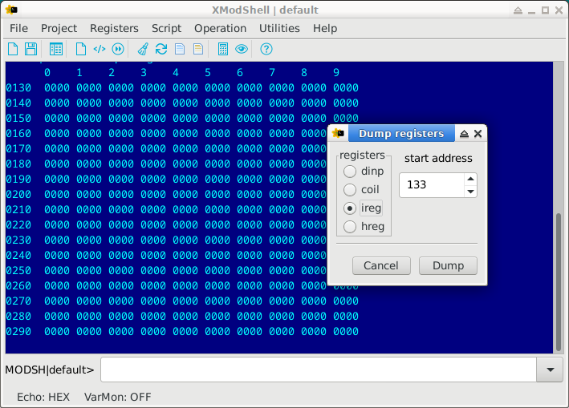
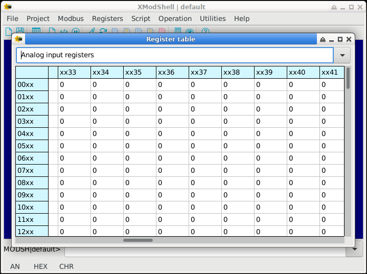
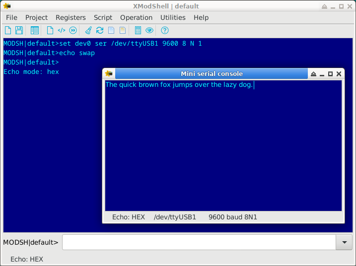
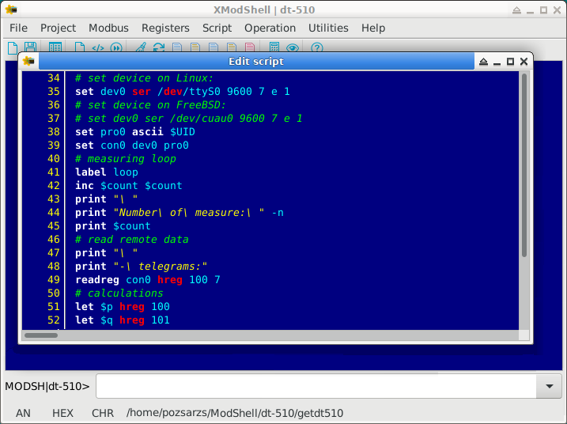
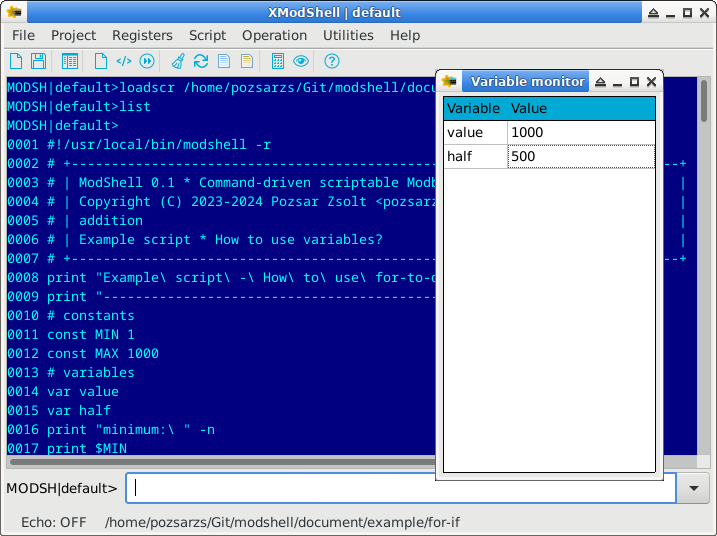

> [!WARNING]
> The program is still under development, it is not yet suitable for its task.  
>

   

## Modshell

**Command-driven scriptable Modbus utility**

Copyright (C) 2023-2024 Pozsár Zsolt <pozsarzs@gmail.com>  

ModShell is a utility built around a command interpreter, which with the
connected peripherals communicates via various ports using the Modbus, DCON and
HART protocols.  

|features                |                                                                                            |
|------------------------|--------------------------------------------------------------------------------------------|
|version                 |v0.1                                                                                        |
|licence                 |EUPL v1.2                                                                                   |
|language                |en, hu                                                                                      |
|architecture            |amd64, armhf, i386, x86_64                                                                  |
|operation system        |DOS, FreeBSD, Linux, Windows                                                                |
|user interface          |ModShell: CLI and TUI                                                                       |
|                        |XModShell: GUI                                                                              |
|running modes           |normal or interpreter                                                                       |
|variables               |max. 128 variables or constants (stored as string)                                          |
|arrays                  |max. 32 dynamic size array of variables or constants (elements stored as string)            |
|built-in commands       |123 commands in 10 categories with macro and script options)                                |
|macros                  |max. 32                                                                                     |
|script size             |max. 1024 line                                                                              |
|example scripts         |10 scripts (shellscript and batch file versions)                                            |
|load from file          |registers, script, settings                                                                 |
|save to file            |command history, console and Modbus traffic, registers, communication settings, user log    |
|auto save to file       |general settings and console traffic                                                        |
|export to file          |history (TXT), registers (CSV, INI, XML)                                                    |
|import to file          |registers (INI, XML)                                                                        |
|configurable devices    |max. 8 settings, serial and ethernet port                                                   |
|configurable protocols  |max. 8 settings, ASCII, RTU or TCP                                                          |
|configurable connections|max. 8 settings by combining the previous two                                               |
|raw serial communication|read/write serial port and mini serial console with A/N or Hex echo                         |
|raw TCP communication   |read/write network device and mini TCP console with A/N or Hex echo                         |
|raw UDP communication   |read/write network device and mini TCP console with A/N or Hex echo                         |
|DCON communication      |read and write remote devices                                                               |
|HART communication      |read and write remote devices                                                               |
|Modbus communication    |read and write remote device and copy between devices                                       |
|                        |internal server for remote access to own registers                                          |
|                        |gateway to access devices using other ports or protocols                                    |
|                        |internal serial monitor for decode ASCII or RTU telegrams                                   |
|local Modbus registers  |2x9999 boolean and 2x9999 word type                                                         |
|script syntax plugins   |for editors using GtkSourceView, MCEdit, Micro, Nano, Notepad++, NeoVim and Vim             |
|other utilities         |command line serial Modbus traffic monitor, serial, TCP and UDP echo servers                |

**Planned releases**  

...that either will or won't.  

 
<i>v0.1:</i>

 This is <i>first unstable release</i>. 
 Unstable, but it is already complete in its intended functionality.
 The software will not include any new features compared to the previous
 release, only bug fixes. All types of binary and installation packages
 will be released along with the source package.  

 
<i>v0.1-beta3:</i>

 <i>Third user test release</i>. 
 The software will not include any new features compared to the previous
 release, only bug fixes. Only a source package will be released.  

 
<i>v0.1-beta2:</i>

 <i>Second user test release</i> will be with the following changes:
 <ul>
  <li>compressed HTML (CHM) help in addition to the existing online Wiki (only XModShell);</li>
  <li>TCP-Modbus/TCP-UDP communication on DOS;</li>
  <li>graphical monitoring the change of values over time (only XModShell);</li>
  <li>converter between Modbus register number and type/address;</li>
  <li>implementation of additional Modbus functions.</li>
 </ul>
 Only a source package will be released.

**Releases**  

_v0.1-beta1:_  
_First user test release_ will be with the following changes:  
 - [x] Elimination of confusion between the terms 'register number' and 'data address';
 - [ ] passing parameters from the operating system command line to the script in interpreter mode;
 - [x] ANSI escape sequences support (only DOS and *nix like systems);
 - [x] command `color` -> `set color`, sets all default colors (CLI and TUI);  
 - [x] command `echo` -> `echometh`, parameters: off|on|hex|swap -> off|an|hex|swap;
 - [x] commands `sercons`, `tcpcons`, `udpcons`: character-to-character or string sending, with alphanumerical or hexadecimal input, with or without alphanumerical or hexhexadecimal echo;  
 - [x] commands `serwrite`, `tcpwrite`, `udpwrite`: alphanumerical or hexadecimal input, with or without alphanumerical or hexadecimal echo;
 - [x] DCON protocol support;  
 - [ ] HART protocol support;  
 - [x] main menu for all consoles in GUI version;  
 - [ ] Modbus/TCP communication on Unix-like OS and Windows;  
 - [x] modified source code structure of XModshell;  
 - [x] new command `chkdevlock`/`rmdevlock` (only *nix systems);  
 - [x] new command `exist`;  
 - [x] new command `inputmeth`;  
 - [x] new command `macro`;
 - [x] new command `mbmon`;  
 - [x] new command `printcolor`(only CLI and TUI);  
 - [x] new command `sendmeth`;  
 - [x] new command `tcpcons`, `tcpread`, `tcpwrite`;  
 - [x] new command `udpcons`, `udpread`, `udpwrite`;  
 - [x] new menu items in the main menu for quick execution of Modbus R/W commands;  
 - [x] new menu items for show and edit all register's value in a big table;  
 - [x] new serial baudrates: 150, 300, 600 baud;
 - [x] serial echo server utility for testing connectivity;  
 - [x] serial ModBus traffic monitor utility;
 - [x] support for variable and constant arrays;  
 - [x] syntax highlighter file for applications using GTKSourceView (for example: Builder, Geany, Gedit, Mousepad, Pluma, Scribes), for Notepad++ (Windows only) and Vim/Neovim;
 - [x] TCP and UPD echo server utilities for testing connectivity.  
 Only a source package will be released.
 

 
<i>v0.1-alpha3:</i>
  
 <i>Third and last developer test release</i> with the following changes:
 <ul>
  <li>New source code directory structure;</li>
  <li>new commands;</li>
  <li>new predefined constants;</li>
  <li>bug fixes;</li>
  <li>GUI (except DOS);</li>
  <li>script syntax highlighting file for MCEdit and Nano.</li>
 </ul>
 Only a source package will be released.  

 
<i>v0.1-alpha2:</i>

 <i>Second developer test release</i> with the following changes:
 <ul>
  <li>Bug fixes;</li>
  <li>Modbus/ASCII and Modbus/RTU communication;</li>
  <li>handling of constants;</li>
  <li>three predefined constants and</li>
  <li>28 new command (total: 94);</li>
  <li>script syntax highlighting file for Micro.</li>
 </ul>
 All types of binary and installation packages will be released along with the source package.  

 
<i>v0.1-alpha1:</i>

 <i>First developer test release</i> is not yet suitable for work, although it is
 functional, but it can only communicate via Modbus/ASCII. The purpose of this
 release is to test the program's construction, operation, packaging, and package
 installation in all supported environments. In addition, the documentation and
 other files are checked for possible typos and errors. Only a source package
 will be released.  

#### 1. Screenshots

**ModShell**

Normal command line

Fullscreen command line

Run example script on bash with ModShell interpreter

**XModShell**

Dump input registers  

Input registers in Register table  

Mini serial console  

Script editor  

Variable monitor  

#### 2. Used external libraries

 - _Convert - Bin/Oct/Dec/Hex number converter_  
   Unit for Turbo Pascal v3.0  
   Public Domain, Copyright (C) 1993 Tom Wellige  
 - _Ararat Synapse Release 40_ [^1]  
   TCP/IP and serial library for FreePascal  
   Modified BSD style license, Copyright (C) 1999-2012 Lukas Gebauer  
 - _ProtCOM v0.1 Protected mode serial port handler for DOS_ [^2]  
   Unit for FreePascal  
   Creative Common Zero Universal v1.0, Copyright (C) 2024 Pozsar Zsolt  

#### 3. About

This is a utility that can be used on several operating systems, which can
communicate with connected equipment using Modbus/ASCII,
Modbus/RTU and Modbus/TCP protocols [^3]. The basic communication protocol
of the program is Modbus, but DCON  and HART was also implemented due to
communication with other devices. The range of foreign protocols may be expanded
later. The program can - even automatically - read, write or copy data from one
device to another (e.g. transferring settings). When copying, the source and
destination register areas can be different.

The ModShell program has a *traditional (CLI)* or *full-screen (TUI) command-line*
interface and is also *suitable for running pre-created scripts* independently
(as a command interpreter). The program provides help on the commands that can
be used, and offers possible values when the parameters are entered incorrectly.
The issued commands are placed in history, which can be browsed with the up/down
arrow keys.

The XModShell program has a *graphical interface (GUI)*, which helps to perform
several operations with dialog windows, but the original command line input
remained available for them (e.g. file selection, settings, etc.) [^4].

**Operating principle**

It must be defined the I/O devices, then the protocols and the connections.
There can be eight of each. The data traffic takes place between the preset
connections. In all cases, the data is sent to or read from the internal buffer.
The size of the buffer is suitable for storing 2*9999 logical and word values of
the same size.

128 variables and 32 arrays (which can also be constants) can be created in
the program, to which we can assign a value of any type (eg.: string, boolean
or integer register value, real number, etc.). Variables and constants can be
used to perform logical and arithmetical operations, and can be used to pass
values to commands.

It is possible to create 32 single-line macros to replace frequently used longer
commands. The program includes 3 pre-created macros, the content of which can
also be changed.

**Projects**

In the program, you can create projects for easier management of settings and
data. The name of the current project is shown in the prompt. The project
directory will be created in the program directory on DOS, and in the ModShell
directory in the user's home directory on all other systems. If only filename
is specified during file operations (without path), this directory will be the
source/destination directory.

**File operations**

The command line history can be exported to a text file and provides it with
the appropriate 'shebang' for the installation method and operating system. You
can easily create a script from this raw file.

Device, protocol and connection settings can be saved and loaded in their own
format. During saving, three typed files are created, with the following
extensions: DDT, PDT, CDT.

All register values can be saved and loaded in their own format. During saving,
two typed files are created, with the following extensions: BDT, IDT.

One or more same type registers can be exported to file. During saving, one text
file is created, with CSV, INI or XML extension. The program can only import
from INI and XML format files.

We can also create time-stamped log entries with the program and or script.

On exit, the command line history, input and echo mode and colors are preserved.

The program also has basic file and directory management commands.

**Script operations**

The script on the disc can be loaded into the already running program and
started manually.

The loaded script can be edited with a line editor, saved to disk or
deleted from the buffer. The graphical version has a simple editor window
with syntax highlighting instead of the line editor.

Variables, constants and macros defined before running the script will be
deleted. It is also possible to observe the values of up to four variables
during runtime and to keep the final values​of constants and variables created
during runtime.

**Raw serial connection**

The program provides the possibility to send and receive raw data via a
serial port, and also includes a very simple serial console. The display of sent
and received data can be turned off or raw text and hexadecimal viewing can be
selected.

**Serial connection with DCON protocol**

The program also provides the possibility to send and receive data with DCON
protocol via a serial port.

**Serial connection with HART protocol**

The program also provides the possibility to send and receive data with HART
protocol via a serial port. A serial/HART gateway may be required for connection.

**Raw TCP connection**

The program provides the possibility to send and receive raw data via network
device with TCP, and also includes a very simple TCP console. The display of
sent and received data can be turned off or raw text and hexadecimal viewing
can be selected.

**Raw UDP connection**

The program provides the possibility to send and receive raw data via network
device with UDP, and also includes a very simple UDP console. The display of
sent and received data can be turned off or raw text and hexadecimal viewing
can be selected.

**Already implemented commands:**

|   |command     |category     |hotkey  |description                                                          |
|--:|:----------:|:-----------:|:------:|---------------------------------------------------------------------|
|  1|`add`       |arithmetic   |        |addition                                                             |
|  2|`avg`       |arithmetic   |        |average calculation                                                  |
|  3|`conv`      |arithmetic   |ALT-C   |convert numbers between BIN, DEC, HEX and OCT format                 |
|  4|`cos`       |arithmetic   |        |cosine function                                                      |
|  5|`cotan`     |arithmetic   |        |cotangent function                                                   |
|  6|`dec`       |arithmetic   |        |decrement integer                                                    |
|  7|`div`       |arithmetic   |        |division                                                             |
|  8|`exp`       |arithmetic   |        |natural exponential                                                  |
|  9|`idiv`      |arithmetic   |        |integer division                                                     |
| 10|`imod`      |arithmetic   |        |modulus division                                                     |
| 11|`inc`       |arithmetic   |        |increment integer                                                    |
| 12|`inrange`   |arithmetic   |        |check the value is in the range                                      |
| 13|`ln`        |arithmetic   |        |natural logarithm                                                    |
| 14|`mul`       |arithmetic   |        |multiplication                                                       |
| 15|`mulinv`    |arithmetic   |        |multiplicative inverse                                               |
| 16|`odd`       |arithmetic   |        |odd or event                                                         |
| 17|`pow2`      |arithmetic   |        |exponentiation of two                                                |
| 18|`pow`       |arithmetic   |        |exponentiation                                                       |
| 19|`prop`      |arithmetic   |        |propotional value calculation (with zero and span)                   |
| 20|`rnd`       |arithmetic   |        |create random integer                                                |
| 21|`round`     |arithmetic   |        |round real number                                                    |
| 22|`sin`       |arithmetic   |        |sine function                                                        |
| 23|`sqr`       |arithmetic   |        |square                                                               |
| 24|`sqrt`      |arithmetic   |        |square root                                                          |
| 25|`sub`       |arithmetic   |        |substraction                                                         |
| 26|`tan`       |arithmetic   |        |tangent function                                                     |
| 27|`copyreg`   |communication|        |copy one or more remote registers between two connections            |
| 28|`dcon`      |communication|        |read or write data from/to remote device with DCON protocol          |
| 29|`hart`      |communication|        |read or write data from/to remote device with HART protocol          |
| 30|`mbgw`      |communication|        |start internal Modbus gateway                                        |
| 31|`mbsrv`     |communication|        |start internal Modbus slave/server                                   |
| 32|`mbmon`     |communication|        |start serial Modbus traffic monitor                                  |
| 33|`readreg`   |communication|ALT-R   |read one or more remote registers                                    |
| 34|`sercons`   |communication|F7      |mini serial console                                                  |
| 35|`serread`   |communication|        |read string from a serial device                                     |
| 36|`serwrite`  |communication|        |write string to a serial device                                      |
| 37|`tcpcons`   |communication|SHIFT-F7|mini TCP console                                                     |
| 38|`tcpread`   |communication|        |read string over the network using TCP                               |
| 39|`tcpwrite`  |communication|        |write string over the network using TCP                              |
| 40|`udpcons`   |communication|        |mini UDP console                                                     |
| 41|`udpread`   |communication|        |read string over the network using UDP                               |
| 42|`udpwrite`  |communication|        |write string over the network using UDP                              |
| 43|`writereg`  |communication|ALT-W   |write data to one or more remote registers                           |
| 44|`get`       |configuration|ALT-G   |get device, protocol, connection, colors, project name and timeout   |
| 45|`reset`     |configuration|ALT-T   |reset device, protocol or connection or reset project name           |
| 46|`set`       |configuration|ALT-S   |set device, protocol, connection, colors, project name and timeout   |
| 47|`applog`    |file         |        |append a record to log file (LOG)                                    |
| 48|`exphis`    |file         |        |export command line history to file (TXT)                            |
| 49|`expreg`    |file         |ALT-E   |export one or more registers to file (CSV, INI, XML)                 |
| 50|`impreg`    |file         |ALT-I   |import one or more registers from file (INI, XML)                    |
| 51|`loadcfg`   |file         |F3      |load settings of device, protocol and connection (?DT)               |
| 52|`loadreg`   |file         |F5      |load all buffer registers from typed file (?DT)                      |
| 53|`savecfg`   |file         |F2      |save settings of device, protocol and connection (?DT)               |
| 54|`savereg`   |file         |F4      |save all registers to typed file (?DT)                               |
| 55|`arrclear`  |general      |        |clear content of an array                                            |
| 56|`arrfill`   |general      |        |fill an array with a character                                       |
| 57|`ascii`     |general      |        |show ASCII table                                                     |
| 58|`beep`      |general      |        |make a beep with internal speaker                                    |
| 59|`carr`      |general      |        |show all constant arrays with theirs size or define a new one        |
| 60|`cls`       |general      |F8      |clear screen                                                         |
| 61|`const`     |general      |        |show all constants with theirs value or define a new one             |
| 62|`cron`      |general      |        |loaded script scheduled execution                                    |
| 63|`date`      |general      |        |show system date and time                                            |
| 64|`echometh`  |general      |F9      |alphanumerical/hexadecimal/none local echo method for connections    |
| 65|`exit`      |general      |F10     |exit                                                                 |
| 65|`for`       |general      |        |loop iteration                                                       |
| 66|`getarrsize`|general      |        |get size of an array                                                 |
| 67|`goto`      |general      |        |jump to specified label                                              |
| 68|`help`      |general      |F1      |show description or usage of the commands                            |
| 69|`if`        |general      |        |selection statement                                                  |
| 70|`inputmeth` |general      |SHIFT-F9|alphanumerical/hexadecimal data input method for connections         |
| 71|`label`     |general      |        |define label (for goto command)                                      |
| 72|`let`       |general      |ALT-L   |set value of a register, variable, a constant or an element of array |
| 73|`macro`     |general      |        |show all macros with theirs value or define a new one                |
| 74|`pause`     |general      |        |waits for a keystroke or specified time                              |
| 75|`printcolor`|general      |        |set temporary foreground and background colors for print in CLI/TUI  |
| 76|`print`     |general      |ALT-P   |print message, value of the variable and register                    |
| 77|`sendmeth`  |general      |CTRL-F9 |char-to-char or string data send method for connections              |
| 78|`setarrsize`|general      |        |set size of an array                                                 |
| 80|`var`       |general      |        |show all variables with theirs value or define a new one             |
| 81|`varmon`    |general      |ALT-M   |monitoring the value of variables                                    |
| 82|`varr`      |general      |        |show all variable arrays with theirs size or define a new one        |
| 83|`ver`       |general      |        |show version and build information of this program                   |
| 84|`and`       |logic        |        |AND logical operations                                               |
| 85|`bit`       |logic        |        |value of the specified bit                                           |
| 86|`not`       |logic        |        |NOT logical operations                                               |
| 87|`or`        |logic        |        |OR logical operations                                                |
| 88|`roll`      |logic        |        |roll bit of integer to left                                          |
| 89|`rolr`      |logic        |        |roll bit of integer to right                                         |
| 90|`shl`       |logic        |        |bit shift to left                                                    |
| 91|`shr`       |logic        |        |bit shift to right                                                   |
| 92|`xor`       |logic        |        |XOR logical operations                                               |
| 93|`dump`      |register     |F6      |dump all registers in binary/hexadecimal format to a table           |
| 94|`edit`      |script       |SHIFT-F4|edit loaded script with line editor                                  |
| 95|`erasescr`  |script       |SHIFT-F8|erase script from buffer                                             |
| 96|`list`      |script       |F11     |list loaded script                                                   |
| 97|`loadscr`   |script       |SHIFT-F3|load ModShell scriptfile from disc                                   |
| 98|`run`       |script       |F12     |run loaded script                                                    |
| 99|`savescr`   |script       |SHIFT-F2|save loaded script to disc                                           |
|100|`chr`       |string       |        |convert byte to char                                                 |
|101|`concat`    |string       |        |concatenate strings                                                  |
|102|`length`    |string       |        |length of string                                                     |
|103|`lowcase`   |string       |        |conversion to lowercase                                              |
|104|`mkcrc`     |string       |        |make CRC value                                                       |
|105|`mklrc`     |string       |        |make LRC value                                                       |
|106|`ord`       |string       |        |convert char to byte                                                 |
|107|`strdel`    |string       |        |delete specified element(s) of the string                            |
|108|`strfind`   |string       |        |find specified element in the string                                 |
|109|`strins`    |string       |        |insert element into string                                           |
|110|`stritem`   |string       |        |specified element of the string                                      |
|111|`strrepl`   |string       |        |replace element in the string                                        |
|112|`upcase`    |string       |        |conversion to uppercase                                              | 
|113|`cd`        |system       |        |change actual directory                                              |
|114|`chkdevlock`|system       |        |check device lock file                                               |
|115|`copy`      |system       |        |copy file                                                            |
|116|`del`       |system       |        |remove file                                                          |
|117|`dir`       |system       |        |list directory content                                               |
|118|`exist`     |system       |        |existence of a file or directory                                     |
|119|`md`        |system       |        |make directory                                                       |
|120|`rd`        |system       |        |remove directory                                                     |
|121|`ren`       |system       |        |rename file                                                          |
|122|`rmdevlock` |system       |        |remove device lock file                                              |
|123|`type`      |system       |        |type file                                                            |

(Commands with function keys (F?) are executed immediately, modifier keys
(ALT-?) only make typing easier.)  

**Predefined constants**

|name    |value                                         |
|--------|----------------------------------------------|
|$?      |exit value of the commands                    |
|$ARGx   |OS command line arguments in interpreter mode |
|$B01    |150 (baud)                                    |
|$B03    |300 (baud)                                    |
|$B06    |600 (baud)                                    |
|$B1     |1200 (baud)                                   |
|$B2     |2400 (baud)                                   |
|$B4     |4800 (baud)                                   |
|$B9     |9600 (baud)                                   |
|$B19    |19200 (baud)                                  |
|$B38    |38400 (baud)                                  |
|$B57    |57600 (baud)                                  |
|$B115   |115200 (baud)                                 |
|$EULER  |value of e (2.7182818284590452354)            |
|$HOME   |user's home directory                         |
|$PI     |value of Pi (3.1415926535897932385)           |
|$PRJDIR |directory of the actual project               |
|$PRJNAME|name of the actual project                    |

**Predefined macros**

|name    |value                               |
|--------|------------------------------------|
|mydev0  |set dev0 set /dev/ttyUSB0 9600 8 n 1|
|mypro0  |set pro0 rtu 1                      |
|mycon0  |set con0 dev0 pro0                  |

These macros can also be changed

**Documentation and Help**

Modshell and XModShell has a minimal built-in help which you can access by
typing help. Additionally, you can view the manual page from *nix shell
(_man modshell_) or _modshell.txt_ on other systems.  

In the graphical version, the Online Wiki can be opened directly from the 'Help'
menu.  

**Contributing**

If you find any bugs, please report them! I am also happy to accept pull
requests from anyone. You can use the GitHub issue tracker to report bugs, ask
questions, or suggest new features.  

**Links**

 - [Homepage](http://www.pozsarzs.hu)  
 - [GitHub repository](https://github.com/pozsarzs/modshell)  
 - [Project webpage on Github](https://pozsarzs.github.io/modshell)  
 - [Online manual on Github](https://github.com/pozsarzs/modshell/wiki)  

**Precompiled binaries and installer packages for several OS and architecture**

> [!TIP]
> The download is done via HTTP. Some browsers are not happy with this and may block it.

|name                                                                                                            |version    |OS              |arch. |type  |note       |
|----------------------------------------------------------------------------------------------------------------|:---------:|:--------------:|:----:|:----:|-----------|
|[source package](https://github.com/pozsarzs/modshell/archive/refs/heads/main.zip)                              |latest     |                |      |zip   |from Github|
|[source package](http://www.pozsarzs.hu/packages/software/modshell/modshell-0.1alpha3.tar.gz)                   |v0.1-alpha3|                |      |tar.gz|           |
|[source package](http://www.pozsarzs.hu/packages/software/modshell/modshell-0.1alpha2.tar.gz)                   |v0.1-alpha2|                |      |tar.gz|           |
|[binary package](http://www.pozsarzs.hu/packages/software/modshell/dos/mdsh01a2.exe)                            |v0.1-alpha2|DOS             |i386  |exe   |SFX        |
|[binary package](http://www.pozsarzs.hu/packages/software/modshell/dos/mdsh01a2.zip)                            |v0.1-alpha2|DOS             |i386  |zip   |           |
|[binary package with source code](http://www.pozsarzs.hu/packages/software/modshell/freedos/mdsh01a2.zip)       |v0.1-alpha2|FreeDOS         |i386  |zip   |           |
|[binary package](http://www.pozsarzs.hu/packages/software/modshell/linux/modshell-0.1alpha2-linux-i386.bin)     |v0.1-alpha2|Linux           |i386  |bin   |SFX        |
|[binary package](http://www.pozsarzs.hu/packages/software/modshell/linux/modshell-0.1alpha2-linux-amd64.bin)    |v0.1-alpha2|Linux           |amd64 |bin   |SFX        |
|[binary package](http://www.pozsarzs.hu/packages/software/modshell/linux/modshell-0.1alpha2-linux-armhf.bin)    |v0.1-alpha2|Linux           |armhf |bin   |SFX        |
|[binary package](http://www.pozsarzs.hu/packages/software/modshell/linux/modshell-0.1alpha2-linux-i386.zip)     |v0.1-alpha2|Linux           |i386  |zip   |           |
|[binary package](http://www.pozsarzs.hu/packages/software/modshell/linux/modshell-0.1alpha2-linux-amd64.zip)    |v0.1-alpha2|Linux           |amd64 |zip   |           |
|[binary package](http://www.pozsarzs.hu/packages/software/modshell/linux/modshell-0.1alpha2-linux-armhf.zip)    |v0.1-alpha2|Linux           |armhf |zip   |           |
|[installer package](http://www.pozsarzs.hu/deb/i386/modshell_0.1alpha2-1_i386.deb)                              |v0.1-alpha2|Debian GNU/Linux|i386  |deb   |           |
|[installer package](http://www.pozsarzs.hu/deb/amd64/modshell_0.1alpha2-1_amd64.deb)                            |v0.1-alpha2|Debian GNU/Linux|amd64 |deb   |           |
|[installer package](http://www.pozsarzs.hu/deb/armhf/modshell_0.1alpha2-1_armhf.deb)                            |v0.1-alpha2|Raspberry Pi OS |armhf |deb   |           |
|[installer package](http://www.pozsarzs.hu/packages/software/modshell/linux/modshell-0.1alpha2-1.i386.rpm)      |v0.1-alpha2|OpenSuSE        |i386  |rpm   |           |
|[installer package](http://www.pozsarzs.hu/packages/software/modshell/linux/modshell-0.1alpha2-1.x86_64.rpm)    |v0.1-alpha2|OpenSuSE        |amd64 |rpm   |           |
|[installer package](http://www.pozsarzs.hu/packages/software/modshell/linux/modshell-0.1alpha2-i386-1.txz)      |v0.1-alpha2|Slackware       |i386  |txz   |           |
|[installer package](http://www.pozsarzs.hu/packages/software/modshell/linux/modshell-0.1alpha2-amd64-1.txz)     |v0.1-alpha2|Slackware       |amd64 |txz   |           |
|[binary package](http://www.pozsarzs.hu/packages/software/modshell/freebsd/modshell-0.1alpha2-freebsd-i386.bin) |v0.1-alpha2|FreeBSD         |i386  |bin   |SFX        |
|[binary package](http://www.pozsarzs.hu/packages/software/modshell/freebsd/modshell-0.1alpha2-freebsd-amd64.bin)|v0.1-alpha2|FreeBSD         |amd64 |bin   |SFX        |
|[binary package](http://www.pozsarzs.hu/packages/software/modshell/freebsd/modshell-0.1alpha2-freebsd-i386.zip) |v0.1-alpha2|FreeBSD         |i386  |zip   |           |
|[binary package](http://www.pozsarzs.hu/packages/software/modshell/freebsd/modshell-0.1alpha2-freebsd-amd64.zip)|v0.1-alpha2|FreeBSD         |amd64 |zip   |           |
|[installer package](http://www.pozsarzs.hu/packages/software/modshell/freebsd/i386/modshell-0.1alpha2.pkg)      |v0.1-alpha2|FreeBSD         |i386  |pkg   |           |
|[installer package](http://www.pozsarzs.hu/packages/software/modshell/freebsd/amd64/modshell-0.1alpha2.pkg)     |v0.1-alpha2|FreeBSD         |amd64 |pkg   |           |
|[binary package](http://www.pozsarzs.hu/packages/software/modshell/windows/modshell-0.1alpha2-win32.zip)        |v0.1-alpha2|Windows         |i386  |zip   |           |
|[binary package](http://www.pozsarzs.hu/packages/software/modshell/windows/modshell-0.1alpha2-win64.zip)        |v0.1-alpha2|Windows         |x86_64|zip   |           |
|[installer package](http://www.pozsarzs.hu/packages/software/modshell/windows/modshell-0.1alpha2-win32.exe)     |v0.1-alpha2|Windows         |i386  |exe   |           |
|[installer package](http://www.pozsarzs.hu/packages/software/modshell/windows/modshell-0.1alpha2-win64.exe)     |v0.1-alpha2|Windows         |x86_64|exe   |           |
|[installer package](http://www.pozsarzs.hu/packages/software/modshell/windows/modshell-0.1alpha2-win32.msi)     |v0.1-alpha2|Windows         |i386  |msi   |           |
|[installer package](http://www.pozsarzs.hu.hu/packages/software/modshell/windows/modshell-0.1alpha2-win64.msi)  |v0.1-alpha2|Windows         |x86_64|msi   |           |
|[source package](http://www.pozsarzs.hu/packages/software/modshell/modshell-0.1alpha1.tar.gz)                   |v0.1-alpha1|                |      |tar.gz|           |

[^1]: [Synapse Github repository](https://github.com/geby/synapse)
[^2]: [ProtCOM Github repository](https://github.com/pozsarzs/protcom)
[^3]: [Modbus](https://modbus.org)
[^4]: [Wiki - Differents between CUI and GUI version](https://github.com/pozsarzs/modshell/wiki/c.-Differents-between-CUI-and-GUI-version)
