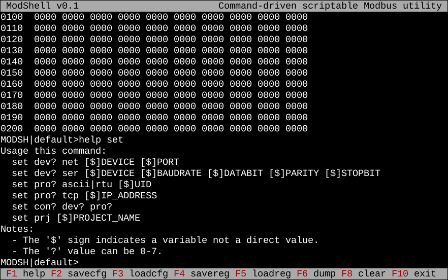

#### Attention! This software is still under development.
---
## Modshell * Command-driven scriptable Modbus utility
Copyright (C) 2023 Pozsár Zsolt <pozsarzs@gmail.com>  
Homepage: <http://www.pozsarzs.hu>  
GitHub: <https://github.com/pozsarzs/modshell>
Online manual: <https://github.com/pozsarzs/modshell/wiki>

#### Software
|features             |                            |
|---------------------|----------------------------|
|architecture         |amd64, armhf, i386, x86_64  |
|operation system     |DOS, FreeBSD, Linux, Windows|
|version              |v0.1                        |
|language             |en, hu                      |
|licence              |EUPL v1.2                   |
|local user interface |CLI and TUI                 |

#### Screenshots
Normal command line  
  
Fullscreen command line  

  

Run example script on bash with ModShell interpreter  
  

#### Used external libraries
 - Bin/Oct/Dec/Hex number converter unit for Turbo Pascal v3.0
   Public Domain, Copyright (C) 1993 Tom Wellige
 - Ararat Synapse Release 40
   modified BSD style license, Copyright (c) 1999-2012 Lukas Gebauer

#### About

*ATTENTION! The program is still under development,
it is not yet suitable for its task.*

This is a utility that can be used on several operating systems,
which can communicate with connected equipment using
[Modbus](https://modbus.org/)/ASCII, Modbus/RTU and Modbus/TCP protocols.
The program can - even automatically - read, write or copy data from
one device to another (e.g. transferring settings). When copying, the
source and destination register areas can be different.

The program has a *traditional (CLI)* or *full-screen (TUI) command-line* interface
and is also *suitable for running pre-created scripts* independently (as a command
interpreter). The program provides help on the commands that can be used, and
offers possible values when the parameters are entered incorrectly. The issued
commands are placed in history, which can be browsed with the up/down arrow keys.

**Operating principle**

It must be defined the I/O devices, then the protocols and the connections.
There can be eight of each. The data traffic takes place between the preset
connections. In all cases, the data is sent to or read from the internal buffer.
The size of the buffer is suitable for storing 2*9999 logical and word values of
the same size. Sixty-four variables can be created in the program, to which we
can assign a value of any type (eg.: message, boolean or integer register
value, etc.) Variables can be used to perform logical and basic mathematical
operations, and can be used to pass values to commands.

**Projects**

In the program, you can create projects for easier management of settings and
data. The name of the current project is shown in the prompt. The project
directory will be created in the program directory on DOS, and in the ModShell
directory in the user's home directory on all other systems. If only filename
is specified during file operations (without path), this directory will be the
source/destination directory.

**File operations**

The command line history can be exported to a text file and provides it with
the appropriate 'shebang' for the installation method and operating system. You
can easily create a script from this raw file.

Device, protocol and connection settings can be saved and loaded in their own
format. During saving, three typed files are created, with the following
extensions: DDT, PDT, CDT.

All register values can be saved and loaded in their own format. During saving,
two typed files are created, with the following extensions: BDT, IDT.

One or more same type registers can be exported to file.
During saving, one text file is created, with CSV extension.

On exit, the command line history and full screen mode command line colors are
preserved.

**Already implemented commands:**  

|command|hotkey|description                                                      |category      |
|-------|------|-----------------------------------------------------------------|--------------|
|copy   |      |copy one or more remote registers between two connections        |communication |
|read   |ALT-R |read one or more remote registers                                |communication |
|write  |ALT-W |write data to one or more remote registers                       |communication |
|exphis |      |export command line history to file (TXT)                        |file operation|
|expreg |ALT-E |export one or more registers to file (CSV, INI, XML)             |file operation|
|impreg |ALT-I |export one or more registers from file (CSV, INI, XML)           |file operation|
|loadcfg|F3    |load settings of device, protocol and connection (?DT)           |file operation|
|loadreg|F5    |load all buffer registers from typed file (?DT)                  |file operation|
|savecfg|F2    |save settings of device, protocol and connection (?DT)           |file operation|
|savereg|F4    |save all registers to typed file (?DT)                           |file operation|
|cls    |F8    |clear screen                                                     |general       |
|color  |      |set foreground and background color in full screen mode          |general       |
|date   |      |show system date and time                                        |general       |
|exit   |F10   |exit                                                             |general       |
|help   |F1    |show description or usage of the commands                        |general       |
|print  |ALT-P |print message, value of the variable and register                |general       |
|var    |      |show all variable with theirs value or define a new one          |general       |
|ver    |      |show version and build information of this program               |general       |
|dump   |F6    |dump all registers in binary/hexadecimal format to a table       |register      |
|let    |ALT-L |set value of a variable or register                              |register      |
|and    |      |AND logical operations                                           |logical       |
|or     |      |OR logical operations                                            |logical       |
|not    |      |NOT logical operations                                           |logical       |
|shl    |      |bit shift to left                                                |logical       |
|shr    |      |bit shift to right                                               |logical       |
|xor    |      |XOR logical operations                                           |logical       |
|add    |      |addition                                                         |mathematic    |
|conv   |ALT-C |convert numbers between BIN, DEC, HEX and OCT format             |mathematic    |
|div    |      |division                                                         |mathematic    |
|mul    |      |multiplication                                                   |mathematic    |
|sub    |      |substraction                                                     |mathematic    |
|get    |ALT-G |get setting of a device, protocol, connection or get project name|settings      |
|reset  |ALT-T |reset device, protocol or connection or reset project name       |settings      |
|set    |ALT-S |set device, protocol or connection or set project name           |settings      |

(Commands with function keys (F?) are executed immediately,
 modifier keys (ALT-?) only make typing easier.)  

**Planned commands in next release (v0.2)**  

|command|hotkey|description                                                   |category      |
|-------|------|--------------------------------------------------------------|--------------|
|srvtcp |      |start/stop transparent Modbus/TCP server                      |communication |
|srvrtu |      |start/stop transparent Modbus/RTU slave                       |communication |
|if     |      |selection statement                                           |general       |
|for    |      |loop iteration                                                |general       |
